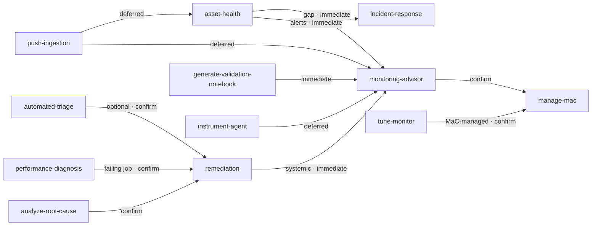

# Cross-skill chaining map

This is the **authoritative chain map** for the toolkit's `## Next` hand-offs: when an atomic skill
finishes, which skill (if any) it hands off to, under what condition, and in which mode. The convention
itself — what `## Next` is, the three modes, and the rules — lives in
[`.claude/rules/skills.md`](../.claude/rules/skills.md). This file is the single source of truth for the
map; `scripts/validate-next-steps.py` validates every skill's `## Next` section against the table below
and runs in CI.

## Modes

- **immediate** — the next skill's inputs are available now; `## Next` says *read and follow* it directly.
- **deferred** — an async/latency dependency must complete first (ingestion landing, trace baselines); `## Next` states the readiness condition and points, but does **not** auto-invoke.
- **confirm** — the next skill mutates state (applies config, runs a fix, updates an alert); `## Next` presents a summary and requires explicit user approval before the write.

## Chain map

| From | Condition | To | Mode |
|------|-----------|----|------|
| asset-health | active alerts found | incident-response | immediate |
| asset-health | thin / no monitor coverage | monitoring-advisor | immediate |
| asset-health | healthy and well-covered | (terminal) | — |
| analyze-root-cause | root cause confirmed, fix applicable | remediation | confirm |
| remediation | systemic (flaky pipeline / missing monitor) | monitoring-advisor | immediate |
| monitoring-advisor | YAML produced | manage-mac | confirm |
| tune-monitor | monitor is MaC-managed | manage-mac | confirm |
| tune-monitor | API-managed (tunes in place itself) | (terminal) | — |
| performance-diagnosis | failing / broken job | remediation | confirm |
| performance-diagnosis | slow / expensive query | (terminal) | — |
| generate-validation-notebook | change validated | monitoring-advisor | immediate |
| instrument-agent | traces verified | monitoring-advisor | deferred |
| push-ingestion | ingestion in flight | monitoring-advisor | deferred |
| push-ingestion | ingestion in flight | asset-health | deferred |
| automated-triage | high-signal unresolved alert (optional) | remediation | confirm |
| manage-mac | — | (terminal) | — |
| connection-auth-rules | — | (terminal) | — |
| storage-cost-analysis | — | (terminal) | — |

## Diagram

Edge labels carry the mode. Nodes with no outgoing edge (`manage-mac`, plus the terminal branches of
`asset-health`, `tune-monitor`, `performance-diagnosis`) are end states — handing off further would
return nothing, which the convention forbids.

## Not in the map (and why)

- **`prevent`** — already chains internally: it invokes `asset-health` (W1) and `monitoring-advisor` (W5)
  as part of its own workflow. It behaves like an orchestrator, so it gets no `## Next`.
- **`incident-response`, `proactive-monitoring`** — orchestrators; they sequence other skills mid-workflow
  via `Read and follow ../<name>/SKILL.md`, not via a terminal `## Next`. (They appear as hand-off
  *targets* above, never as a `## Next` source.)
- **`context-detection`** — the entry router, not a workflow with an end state.
- **`manage-mac`, `connection-auth-rules`, `storage-cost-analysis`** — terminal: a YAML authoring hub, a
  one-shot config generator, and an analysis whose cleanup happens outside the toolkit, respectively.
