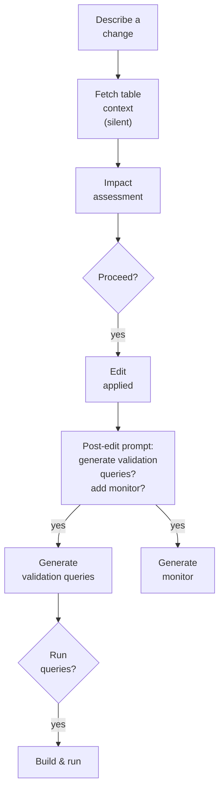

# Monte Carlo Prevent Skill

Bring Monte Carlo data observability into your editor — automatically, before you write a single line of code.

## What this does

When you reference a dbt model or table, Monte Carlo context comes to you: table health, active alerts, lineage, and downstream blast radius. Your AI editor uses that context to shape the code it writes — not just surface it. If you try to rename a column with 500 downstream dependents, the editor recommends a safe transition strategy and explains why, citing the specific MC data it found. When you add new logic, it generates and deploys the right monitor for your logic — validation, metric, comparison, or custom SQL — before you merge. When you're done with a change, it generates targeted validation queries — tailored to the specific columns, filters, and business logic you modified — so you can verify the change behaved as intended before merging.

## Editor & Stack Compatibility

The skill works with any AI editor that supports MCP and the Agent Skills format — including Claude Code, Cursor, and VS Code.

For data stacks, compatibility varies by how you work:

| Stack | Support | Notes |
|---|---|---|
| dbt + any MC-supported warehouse | ✅ Full | Optimized and tested |
| SQL-first, no dbt | 🟡 Partial | Core workflows work via explicit prompting; auto-triggers on file open coming soon |
| Databricks notebooks | 🟡 Partial | Health check, impact assessment, and alert triage work; file-based triggers coming soon |
| SQLMesh | 🟡 Partial | Core workflows work; native SQLMesh project structure support coming soon |
| PySpark / non-SQL pipelines | 🟠 Limited | Manual prompting only; broader support on the roadmap |

**Coming shortly:** Generic SQL file triggers, Databricks notebook support, and SQLMesh project structure support — so auto-activation works regardless of your transformation tool.

Core workflows — table health check, change impact assessment, alert triage, and monitor generation — work for any warehouse supported by Monte Carlo.


## Prerequisites

- Claude Code, Cursor, VS Code or any editors with MCP support
- Monte Carlo account with Editor role or above
- [MC CLI](https://docs.getmontecarlo.com/docs/using-the-cli) installed for monitor deployment (`pip install montecarlodata`)

## Setup

### Via the mc-agent-toolkit plugin (recommended)

Install the plugin for your editor — it bundles the skill, hooks, MCP server, and permissions automatically. See the [main README](../../README.md#installing-the-plugin-recommended) for editor-specific instructions.

### Standalone

1. Configure the Monte Carlo MCP server:
   ```
   claude mcp add --transport http monte-carlo-mcp https://mcp.getmontecarlo.com/mcp
   ```

2. Install the skill:
   ```bash
   npx skills add monte-carlo-data/mc-agent-toolkit --skill prevent
   ```

3. Authenticate: run `/mcp` in your editor, select `monte-carlo-mcp`, and complete the OAuth flow.

4. Verify: ask your editor "Test my Monte Carlo connection" — it should call `testConnection` and confirm.

<details>
<summary>Legacy: header-based auth (for MCP clients without HTTP transport)</summary>

If your MCP client doesn't support HTTP transport, use `.mcp.json.example` with `npx mcp-remote` and header-based authentication. See the [MCP server docs](https://docs.getmontecarlo.com/docs/mcp-server) for details.

</details>

## How to use it

Open your dbt project (or any data engineering codebase) in your editor. Describe the change you want to make — or reference a model file together with an edit (`@models/orders.sql add a column`). The skill activates automatically when you express change intent; no special commands needed.

### End-to-end flow



**Impact assessment** — Before any SQL edit (including filter changes, bugfixes, reverts, and parameter tweaks), prevent surfaces the change's blast radius: downstream models, active alerts, column exposure in recent queries, and monitor coverage. You get a risk tier (High / Medium / Low) and a recommendation tied to your specific change. If the data suggests your approach is risky, Claude proposes a safer alternative.

**Validation queries** — When you're ready to test a change, say "generate validation queries", "validate this change", or run `/mc-validate`. Prevent generates 3–5 targeted SQL queries based on what you actually changed — null checks, before/after row counts, distribution checks — saved to `validation/<table_name>_<timestamp>.sql` with inline comments describing a passing result.

**Monitor coverage** — After you finish an edit, if the impact assessment found a coverage gap, prevent prompts you to add a monitor. On yes, it hands off to `monte-carlo-monitoring-advisor` to produce a validation, metric, comparison, or custom SQL monitor as code.

**Validate in sandbox (`/mc-validate run`)** — Two-phase workflow. Run `/mc-validate` first to generate the queries, then `/mc-validate run` to execute them:

- **Build (W4.1)** — parses your `profiles.yml`, classifies the resolved database (personal / dev / shared-dev / prod / unknown), detects hard-coded `database:` overrides in the model's `{{ config() }}`, and runs `dbt build --select <model>` into your dev database. Hard-stops if the resolved database is shared prod. Skipped automatically for YAML/docs-only diffs.
- **Execute (W4.2)** — substitutes `<YOUR_DEV_DATABASE>` in the generated SQL with a user-confirmed value, surfaces every database the queries will touch, enforces read-only before execution, runs each query through the Snowflake MCP, and reports per-query ✅/⚠️/🔴 verdicts plus a consolidated summary grounded in each query's "What to look for" comment.

`/mc-validate run` does **not** auto-generate. If no validation file exists for your changed model, the command aborts and tells you to run `/mc-validate` first.

> ⚠️ **Heads up on prod vs. dev detection.** The build phase classifies your
> resolved target as `personal` / `dev` / `shared-dev` / `prod` / `unknown`
> from your `profiles.yml` and any hard-coded `{{ config(database=...) }}`,
> and hard-stops if it lands on `prod`. This is a safety net, not a
> guarantee — naming conventions vary across orgs and the classifier can be
> wrong (especially on `unknown`). **You are still responsible for confirming
> the target database before approving the build.** Read the value the skill
> surfaces and don't approve if it doesn't match where you intend to write.

**Invocation modes:**

| Command | What it does |
|---|---|
| `/mc-validate` | Default = generate. Runs query generation only (W3). |
| `/mc-validate generate` | Explicit generate. Same as above. |
| `/mc-validate run` | Runs **W4.1 (Build) + W4.2 (Execute)**. Requires queries already generated. |
| `/mc-validate run --skip-build` | Runs **W4.2 only** — assumes you built manually. Requires queries already generated. |
| `/mc-validate run --dev-db <NAME>` | Same as `run`, bypasses the dev-database prompt in W4.2. |

#### `/mc-validate run` prerequisites

The `run` subcommand only works if all three of the following are in place — otherwise the flow will fail mid-build with a confusing error. Verify before invoking:

- **dbt installed** and a `dbt_project.yml` discoverable from the changed model (the workflow walks up from the model file to find it).
- **`profiles.yml`** present (typically in `~/.dbt/profiles.yml`) with a working Snowflake target. The skill parses it to resolve your dev database.
- **Snowflake MCP server** registered in the editor session — the skill detects this by looking for an `mcp__snowflake__*` tool. Without it, queries cannot execute and the substituted SQL is left on disk for you to run manually.

The `run` subcommand performs a connection pre-flight check before kicking off the build. If any prerequisite is missing, it aborts early and tells you what to fix — rather than failing after a partial build.

### Deploying generated monitors

When Claude generates a monitor, it saves the YAML to `monitors/<table>.yml`. Deploy with:

```bash
montecarlo monitors apply --dry-run    # preview
montecarlo monitors apply --auto-yes   # apply
```

Your project needs a `montecarlo.yml` config in the working directory:

```yaml
version: 1
namespace: <your-namespace>
default_resource: <your-warehouse-name>
```

## Troubleshooting

See [TROUBLESHOOTING.md](TROUBLESHOOTING.md) for common setup and runtime issues.
