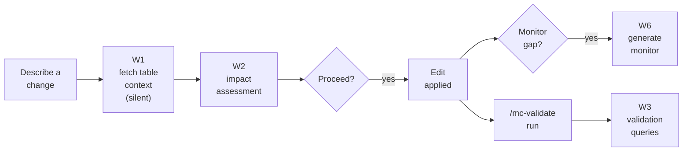

# Monte Carlo Prevent Skill

Bring Monte Carlo data observability into your editor — automatically, before you write a single line of code.

## What this does

When you reference a dbt model or table, Monte Carlo context comes to you: table health, active alerts, lineage, and downstream blast radius. Your AI editor uses that context to shape the code it writes — not just surface it. If you try to rename a column with 500 downstream dependents, the editor recommends a safe transition strategy and explains why, citing the specific MC data it found. When you add new logic, it generates and deploys the right monitor for your logic — validation, metric, comparison, or custom SQL — before you merge. When you're done with a change, it generates targeted validation queries — tailored to the specific columns, filters, and business logic you modified — so you can verify the change behaved as intended before merging.

## Editor & Stack Compatibility

The skill works with any AI editor that supports MCP and the Agent Skills format — including Claude Code, Cursor, and VS Code.

For data stacks, compatibility varies by how you work:

| Stack | Support | Notes |
|---|---|---|
| dbt + any MC-supported warehouse | ✅ Full | Optimized and tested |
| SQL-first, no dbt | 🟡 Partial | Core workflows work via explicit prompting; auto-triggers on file open coming soon |
| Databricks notebooks | 🟡 Partial | Health check, impact assessment, and alert triage work; file-based triggers coming soon |
| SQLMesh | 🟡 Partial | Core workflows work; native SQLMesh project structure support coming soon |
| PySpark / non-SQL pipelines | 🟠 Limited | Manual prompting only; broader support on the roadmap |

**Coming shortly:** Generic SQL file triggers, Databricks notebook support, and SQLMesh project structure support — so auto-activation works regardless of your transformation tool.

Core workflows — table health check, change impact assessment, alert triage, and monitor generation — work for any warehouse supported by Monte Carlo.


## Prerequisites

- Claude Code, Cursor, VS Code or any editors with MCP support
- Monte Carlo account with Editor role or above
- [MC CLI](https://docs.getmontecarlo.com/docs/using-the-cli) installed for monitor deployment (`pip install montecarlodata`)

## Setup

### Via the mc-agent-toolkit plugin (recommended)

Install the plugin for your editor — it bundles the skill, hooks, MCP server, and permissions automatically. See the [main README](../../README.md#installing-the-plugin-recommended) for editor-specific instructions.

### Standalone

1. Configure the Monte Carlo MCP server:
   ```
   claude mcp add --transport http monte-carlo-mcp https://mcp.getmontecarlo.com/mcp
   ```

2. Install the skill:
   ```bash
   npx skills add monte-carlo-data/mc-agent-toolkit --skill prevent
   ```

3. Authenticate: run `/mcp` in your editor, select `monte-carlo-mcp`, and complete the OAuth flow.

4. Verify: ask your editor "Test my Monte Carlo connection" — it should call `testConnection` and confirm.

<details>
<summary>Legacy: header-based auth (for MCP clients without HTTP transport)</summary>

If your MCP client doesn't support HTTP transport, use `.mcp.json.example` with `npx mcp-remote` and header-based authentication. See the [MCP server docs](https://docs.getmontecarlo.com/docs/mcp-server) for details.

</details>

## How to use it

Open your dbt project (or any data engineering codebase) in your editor. Describe the change you want to make — or reference a model file together with an edit (`@models/orders.sql add a column`). The skill activates automatically when you express change intent; no special commands needed.

### End-to-end flow



W1 (asset-health) runs silently and feeds W2 — you see one report, not two. W6 delegates to `monte-carlo-monitoring-advisor`. Standalone health questions ("how is X doing?") go directly to `monte-carlo-asset-health`, not to prevent.

**Workflow 1 — Asset health pre-fetch (silent):** Runs as a precursor to Workflow 2 whenever you express change intent on a table that hasn't been seen this session. Hands off to `monte-carlo-asset-health` to gather lineage, alerts, monitors, and freshness. The report is used as data for the impact assessment, not shown directly — you only see disambiguation prompts (when multiple matching tables exist) or stop-the-world warnings (active critical alerts, severe staleness).

**Workflow 2 — Change impact assessment:** Fires automatically before any SQL edit — including filter changes, bugfixes, reverts, and parameter tweaks, not just schema changes. Surfaces downstream blast radius, active incidents, column exposure in recent queries, and monitor coverage. Reports a risk tier (High / Medium / Low) and translates the findings into a specific code recommendation. If the MC data suggests your planned approach is risky, Claude will recommend a safer alternative and explain why — citing the specific tables, alert counts, and read volumes it found.

**Workflow 3 — Change validation queries:** After you've made a change and are ready to test it, say something like "generate validation queries" or "validate this change". Claude generates 3–5 targeted SQL queries based on the Workflow 2 findings and the diff — null checks, before/after row counts, distribution checks — using the exact column names, filter logic, and business rules from your change. Queries are saved to `validation/<table_name>_<timestamp>.sql` with inline comments explaining what a passing result looks like for each check. Does not activate automatically; only runs when you ask.

**Workflow 6 — Add monitor (delegated, post-edit):** After you finish an edit, the post-edit hook prompts you about monitor coverage if the impact assessment found a gap. On yes, prevent hands off to the `monte-carlo-monitoring-advisor` skill, which generates a validation, metric, comparison, or custom SQL monitor as code. Workflows 4 and 5 are reserved for sandbox-build / execute-validation steps that land via `/mc-validate run`.

### Deploying generated monitors

When Claude generates a monitor, it saves the YAML to `monitors/<table>.yml`. Deploy with:

```bash
montecarlo monitors apply --dry-run    # preview
montecarlo monitors apply --auto-yes   # apply
```

Your project needs a `montecarlo.yml` config in the working directory:

```yaml
version: 1
namespace: <your-namespace>
default_resource: <your-warehouse-name>
```

## Troubleshooting

See [TROUBLESHOOTING.md](TROUBLESHOOTING.md) for common setup and runtime issues.
